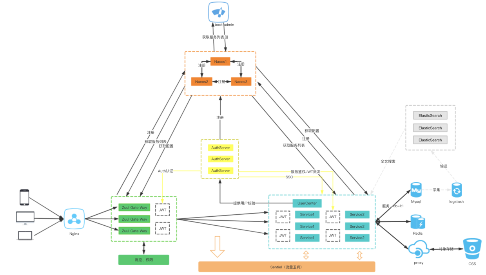
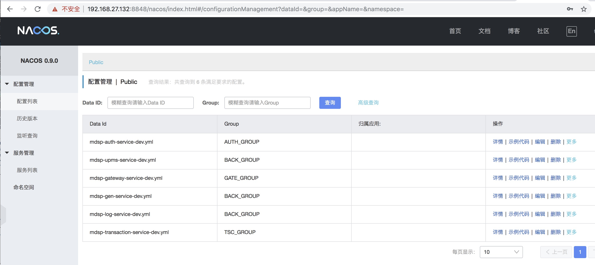
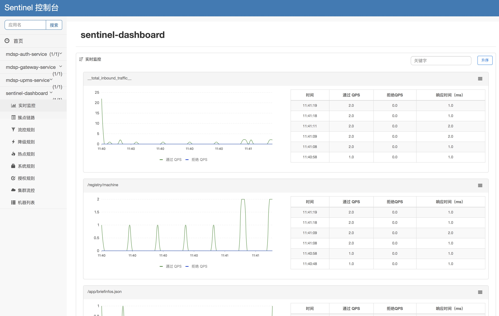
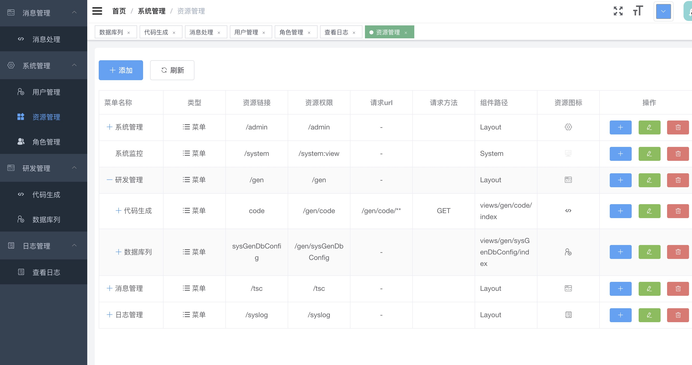
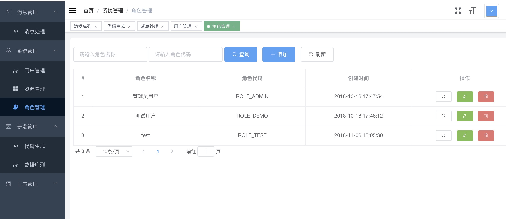
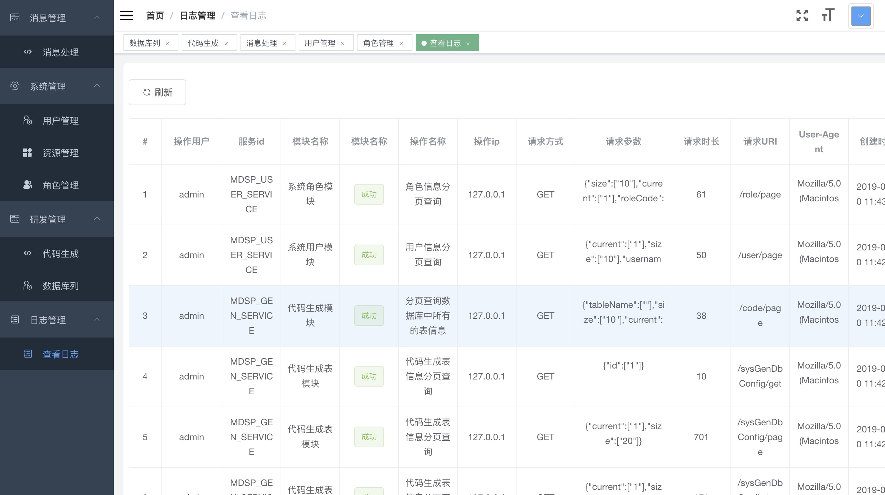
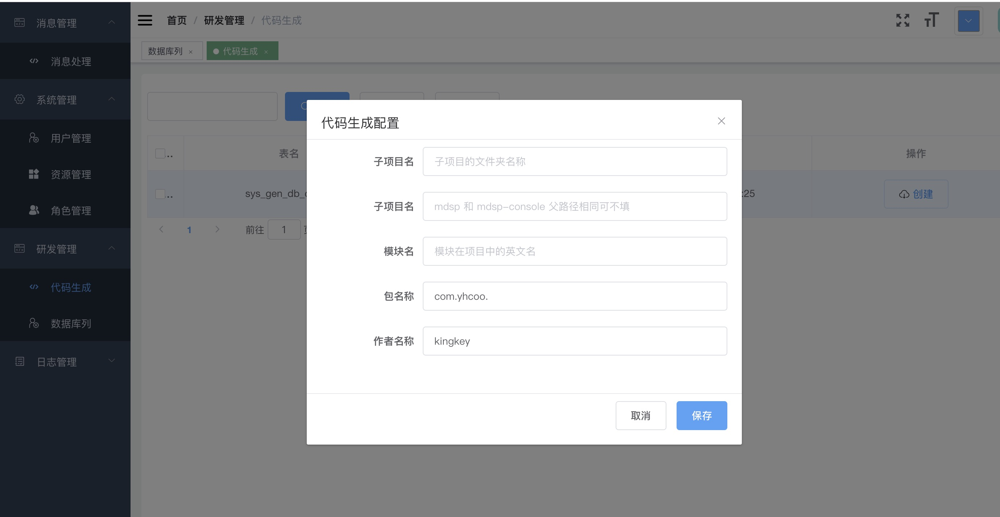

# MDSP
MDSP ：（Mobile Dynamic Service Platform）移动动态服务平台。
该项目基于Spring cloud Alibaba,Oauth2,基于VUE, element-ui ,
axios , echarts 的后台权限管理框架,集成了基于MQ的可靠消息的分布
式事务解决方案。该项目将提供对 Taro ,RN, MDS 等框架开发的移动端应
用做运维发布支持。

### 架构摘要
#### 服务鉴权
通过`JWT`的方式来加强服务之间调度的权限验证，保证内部服务的安全性。


#### 监控
目前主要的一些 APM 工具有: Cat、Zipkin、Pinpoint、SkyWalking，这里使用 SkyWalking ，它是一款优秀的国产 APM 工具，包括了分布式追踪、性能指标分析、应用和服务依赖分析等。


#### 服务注册与调用
基于Nacos来实现的服务注册与调用，在Spring Cloud中使用Feign, 我们可以做到使用HTTP请求远程服务时能与调用本地方法一
样的编码体验，开发者完全感知不到这是远程方法，更感知不到这是个HTTP请求。


#### 负载均衡&熔断机制
采用了`Sentinel` 以流量为切入点，从流量控制、熔断降级、系统负载保护等多个维度来帮助您保护服务的稳定性。


#### 分布式事务方案
基于mq最终一致性实现可靠消息的分布式事务方案。


#### 使用雪花ID
主键id,Snowflake雪花算法，优点：生成有顺序的id，提高数据库的性能,现在大部分都不用uuid作为主键，因为不规则，
每向数据库插入一条数据就要重新排列，使数据库性能降低。并且整个分布式系统内不会产生ID碰撞。

#### 自定义 springboot-starter
实现日志收集、OSS自动加载等，使得我们在开发业务代码时能
够非常方便的、不需要过多关注框架的配置，而只需要关注业务即可。


## 功能展示






## 技术栈
此项目是 Spring cloud Oauth2 构建的后台管理系统，采用以下技术
- 注册中心：Nacos
- 服务网关：Spring cloud-Gateway
- 配置中心：Nacos
- 服务调用：Spring-cloud-open-Feign
- 负载均衡：Spring-cloud-loadbalancer
- 熔断降级：Sentinel
- 链路追踪：Skywalking
- 消息队列：RabbitMQ
- 权限认证：Spring secruity Oauth2
- ORM框架：MyBatisPlus
- 部署：Docker+Rancher


# 项目结构说明
- mdsp-common 公共模块
- mdsp-auth  Oauth2 认证服务器 提供token
- mdsp-gateway 后端统一入口，提供动态路由，oauth2的资源服务器
- mdsp-monitor Spring boot admin监控以及Skywalking监控
- mdsp-log 日志中心模块
- mdsp-gen 代码生成模块
- mdsp-transcation 基于mq最终一致性实现可靠消息的分布式事务方案
  - mdsp-transaction-message 独立消息服务微服务
  - mdsp-transaction-sample 基于支付宝转账的演示
  - mdsp-transaction-console 消息补偿管理后台
- mdsp-starter 自定义封装各种starer 目前封装了日志处理
  - mdsp-cache-spring-boot-starter-parent 缓存自定义starer
  - mdsp-log-spring-boot-starter-parent 日志自定义starer（自动入库）
  - mdsp-oss-spring-boot-starter-parent OSS自定义starer （支持 阿里云，七牛，腾讯）
- mdsp-modules 自定义封装各种starer 目前封装了日志处理
  - mdsp-upms 通用用户权限系统
  - mdsp-website 企业官网


## 环境准备

### 安装 Nacos
- 下载 https://github.com/alibaba/nacos/releases
- 安装 
    - 解压到指定⽬目录
- 运⾏
    - 命令: nohup sh startup.sh -m standalone &
    
- 查看
    - http://192.168.27.132F8848/nacos/index.html
    - ⽤用户名密码 : nacos / nacos
- 使 Nacos 支持 MYSQL
    - 执行数据脚本 /db/nacos_config.sql    
    - application.properties
    
```$xslt

# MYSQL
spring.datasource.platform=mysql

db.num=1
db.url.0=jdbc:mysql://127.0.0.1:3306/nacos_config?characterEncoding=utf8&connectTimeout=1000&socketTimeout=3000&autoReconnect=true
db.user=root
db.password=密码

```

- 修改 Nacos 配置中的 MySql 密码为⾃己系统的密码

### 安装 Redis

- 启动即可，无密码

### 安装 Rabbit MQ
- 添加⽤户及密码: mdsp / mdsp
    - 设置 tags 为 Admin
- 添加权限
    - 设置 Virtual Host 为 /
    - Configure regexp 为 .*
    - Write regexp 为 .*
    - Read regexp 为 .*

## 项目运行

git clone https://github.com/mdsp-team/mdsp
- 添加数据库
  - mdsp_schema.sql
- 导入数据
  - mdsp_upms.sql
  - nacos_config.sql
  - mdsp_route.sql
  - mdsp_msg.sql 
  - mdsp_log.sql
  - mdsp_gen.sql

- 启动服务  
  MdspAuthServiceApplication
  MdspUpmsServiceApplication
  MdspLogServiceApplication
  MdspGenServiceApplication
  MdspTscMsgApplication
  MdspTransactionMsgServiceWeb
  MdspGatewayApplication


## 前端启动参照前端项目
>  传送门：[前端项目地址](https://github.com/mdsp-team/mdsp-console) 


# 功能列表

- [x] 登录/注销 -- 完成
- [x] 权限管理 -- 完成
- [x] 消息管理 -- 完成
- [x] 日志展示 -- 完成
- [x] 管理用户 -- 完成
- [x] 管理员设置 -- 完成
- [x] 图表📈 -- 完成
- [x] 日志记录 -- 完成
- [x] 代码生成 -- 完成

# 计划任务

- [x] MDSP 应用管理 -- 正在开发
- [x] MDSP 升级服务 -- 正在开发
- [x] MDSP 灰度发布 -- 正在开发

# 捐赠

- 如果我们的项目对您有帮助，欢迎捐赠
- 若获得足够的捐赠，将购置服务器发布项目

<table>
  <tr>
    <th width="50%">支付宝</th>
    <th width="50%">微信</th>
  </tr>
  <tr></tr>
  <tr align="center">
    <td></td>
    <td></td>
  </tr>
</table>


